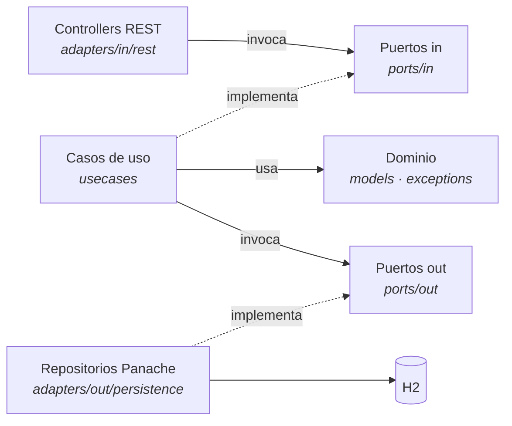

# Coffee Roasters

API de tostión de café construida con **Quarkus** y arquitectura hexagonal, con un frontend estático que consume la propia API.

- Backend: Quarkus 3.38 + Hibernate ORM con Panache + H2
- Frontend: HTML/CSS/JS sin build step, servido por el mismo Quarkus
- Respuestas y errores localizados en español e inglés vía `Accept-Language`

> Este proyecto se construyó como taller de **arquitectura hexagonal (puertos y adaptadores)**.
> Si vienes por eso, salta directo a [Arquitectura](#7-arquitectura-hexagonal).

## Contenido

1. [Requisitos](#1-requisitos)
2. [Levantar el servidor de desarrollo](#2-levantar-el-servidor-de-desarrollo)
3. [Levantar en producción](#3-levantar-en-producción)
4. [Docker](#4-docker)
5. [Desplegar en Render](#5-desplegar-en-render)
6. [La API](#6-la-api)
7. [Arquitectura hexagonal](#7-arquitectura-hexagonal)
8. [Base de datos](#8-base-de-datos)
9. [Tests](#9-tests)
10. [Problemas comunes](#10-problemas-comunes)

---

## 1. Requisitos

| Herramienta | Versión | Nota |
| --- | --- | --- |
| JDK | **21** | Fijado en `pom.xml` (`maven.compiler.release=21`) |
| Maven | — | No hace falta instalarlo, el repo trae el wrapper `mvnw` |
| Docker | opcional | Solo para construir la imagen o desplegar |

### Instalar y seleccionar Java 21

El repo ya declara la versión en [mise.toml](mise.toml), así que si usas [mise](https://mise.jdx.dev/) basta con:

```bash
mise install
```

Alternativas según tu sistema:

```bash
# macOS / Linux con SDKMAN
sdk install java 21.0.5-tem
sdk use java 21.0.5-tem

# Windows con winget
winget install EclipseAdoptium.Temurin.21.JDK
```

### Verificar que quedó bien

```bash
java -version      # debe decir 21.x
./mvnw -v          # "Java version: 21..."
```

Si `java -version` muestra otra versión, apunta `JAVA_HOME` al JDK 21:

```bash
# Git Bash / WSL / Linux / macOS
export JAVA_HOME="/c/Program Files/Eclipse Adoptium/jdk-21.0.5.11-hotspot"
export PATH="$JAVA_HOME/bin:$PATH"
```

```powershell
# PowerShell (permanente, requiere reabrir la terminal)
[Environment]::SetEnvironmentVariable("JAVA_HOME", "C:\Program Files\Eclipse Adoptium\jdk-21.0.5.11-hotspot", "User")
```

---

## 2. Levantar el servidor de desarrollo

```bash
./mvnw quarkus:dev
```

> En Git Bash y PowerShell es `./mvnw` (con el `./`). En CMD es `mvnw.cmd`.

Queda disponible en:

| URL | Qué es |
| --- | --- |
| <http://localhost:8080/> | Frontend |
| <http://localhost:8080/api/grains> | API |
| <http://localhost:8080/q/dev/> | Dev UI de Quarkus (solo en dev) |

Lo que te da el modo dev:

- **Live reload**: guardas un `.java`, `.html`, `.css` o `.js` y el siguiente request ya trae el cambio. No hay que reiniciar.
- La base H2 se recrea en cada arranque y recarga [import.sql](src/main/resources/import.sql).
- Presiona `r` en la terminal para correr los tests, `d` para abrir la Dev UI, `q` para salir.

### Cambiar el puerto

```bash
./mvnw quarkus:dev -Dquarkus.http.port=8081
```

---

## 3. Levantar en producción

### Empaquetar

```bash
./mvnw package
```

Genera `target/quarkus-app/`. No es un über-jar: las dependencias quedan en `target/quarkus-app/lib/`, por eso **hay que conservar la carpeta completa**, no solo el `.jar`.

### Ejecutar

```bash
java -jar target/quarkus-app/quarkus-run.jar
```

Arranca en el puerto `8080`, o en el que indique la variable de entorno `PORT`:

```bash
PORT=10000 java -jar target/quarkus-app/quarkus-run.jar
```

Para saltarte los tests al empaquetar:

```bash
./mvnw package -DskipTests
```

### Über-jar (un solo archivo)

```bash
./mvnw package -Dquarkus.package.jar.type=uber-jar
java -jar target/coffee-roasters-1.0.0-SNAPSHOT-runner.jar
```

### Ejecutable nativo

Requiere GraalVM, o Docker si usas el build en contenedor:

```bash
./mvnw package -Dnative
./mvnw package -Dnative -Dquarkus.native.container-build=true   # sin GraalVM local

./target/coffee-roasters-1.0.0-SNAPSHOT-runner
```

---

## 4. Docker

El [Dockerfile](Dockerfile) de la raíz es multi-stage: compila con Maven y solo copia el resultado a la imagen final, así que **no necesitas empaquetar antes**.

```bash
docker build -t coffee-roasters .
docker run --rm -p 8080:8080 coffee-roasters
```

Los archivos en `src/main/docker/` son los que genera Quarkus y esperan un `target/` ya construido; el de la raíz es el que se usa para desplegar.

---

## 5. Desplegar en Render

1. Sube el repo a GitHub.
2. En Render: **New → Blueprint** y selecciona el repo. Lee [render.yaml](render.yaml) y configura el servicio solo.
   - Si prefieres hacerlo a mano: **New → Web Service**, runtime **Docker**, plan **Free**. No requiere variables de entorno.
3. Deploy. El primer build es lento porque descarga todas las dependencias de Quarkus.

Dos cosas del plan gratuito:

- El servicio **se duerme** tras ~15 min sin tráfico; el primer request después tarda cerca de un minuto.
- H2 es **en memoria**, así que cada reinicio borra los pedidos y recarga el catálogo semilla.

> Vercel no sirve para esto: no tiene runtime de JVM.

---

## 6. La API

Todos los endpoints cuelgan de `/api` y devuelven el mismo sobre:

```json
{ "status": 200, "data": [], "message": "Granos consultados" }
```

Los errores agregan el objeto `error` con `code`, `details`, `timestamp` y `path`.

| Método | Ruta | Qué hace |
| --- | --- | --- |
| `GET` | `/api/grains` | Lista los granos |
| `POST` | `/api/grains` | Crea un grano |
| `PUT` | `/api/grains/{id}` | Actualiza un grano |
| `DELETE` | `/api/grains/{id}` | Elimina un grano |
| `POST` | `/api/grains/{id}/inventory/additions` | Suma inventario |
| `POST` | `/api/grains/{id}/inventory/removals` | Descuenta inventario |
| `GET` | `/api/preparation-methods` | Lista los métodos |
| `POST` | `/api/preparation-methods` | Crea un método |
| `PUT` | `/api/preparation-methods/{id}` | Actualiza un método |
| `DELETE` | `/api/preparation-methods/{id}` | Elimina un método |
| `GET` | `/api/orders` | Lista los pedidos |
| `POST` | `/api/orders` | Crea y confirma un pedido |

### Ejemplos

```bash
curl localhost:8080/api/grains

curl -X POST localhost:8080/api/orders \
  -H 'Content-Type: application/json' \
  -d '{"grainId":1,"preparationMethodId":1,"quantityInGrams":250}'
```

El header `Accept-Language` cambia el idioma de la respuesta:

```bash
curl localhost:8080/api/orders -H 'Accept-Language: en'
```

### Códigos de error

| HTTP | Cuándo |
| --- | --- |
| `400` | Falla Bean Validation o el JSON está malformado |
| `404` | El recurso referenciado no existe |
| `409` | Choque con el estado actual (nombre duplicado, stock insuficiente) |
| `422` | Se incumple una regla de negocio del dominio |

---

## 7. Arquitectura hexagonal

### 7.1 La idea

La arquitectura hexagonal, o **puertos y adaptadores**, parte de una sola pregunta: *¿de qué debería depender la lógica de negocio?* La respuesta es **de nada**. Ni de la base de datos, ni del framework web, ni del formato JSON.

Para lograrlo se invierte la dependencia. En una arquitectura por capas tradicional el servicio llama al repositorio y por tanto **depende** de él. Aquí el caso de uso declara una **interfaz** con lo que necesita (`OrderRepositoryPort`) y es la infraestructura la que se adapta a ese contrato. La flecha de dependencia queda apuntando hacia adentro:



Fíjate en las dos flechas punteadas: van **desde la implementación hacia la interfaz**. Eso es la inversión de dependencias, y es lo que permite que `CoffeeOrderService` no sepa que existe Hibernate.

- **Lado izquierdo (driving)**: quien provoca la acción. Aquí es REST, pero podría ser un CLI, un consumidor de Kafka o un test.
- **Lado derecho (driven)**: lo que la aplicación necesita para trabajar. Aquí es H2 vía Panache, pero podría ser Postgres, un `Map` en memoria o un mock.

### 7.2 Estructura de carpetas

```
src/main/java/
├── domain/                     # El hexágono. Cero dependencias de frameworks
│   ├── models/                 # Grain, Order, OrderStatus, PreparationMethod
│   └── exceptions/             # Fábricas de error por agregado
│       └── codes/              # Códigos estables de cara al cliente
│
├── application/                # Orquestación. Conoce el dominio y sus puertos
│   ├── ports/in/               # Qué puede pedirle el mundo a la aplicación
│   ├── ports/out/              # Qué necesita la aplicación del mundo
│   └── usecases/               # Implementación de los puertos in
│
├── infrastructure/adapters/    # Todo lo que huele a framework
│   ├── in/rest/                # Adaptadores de entrada (driving)
│   │   ├── controllers/        # Recursos JAX-RS
│   │   └── dtos/               # Request y response del borde HTTP
│   └── out/persistence/        # Adaptadores de salida (driven)
│       ├── entities/           # Entidades JPA
│       ├── mappers/            # Entidad ↔ modelo de dominio
│       └── repositories/       # Implementación de los puertos out
│
└── shared/                     # Transversal, con su propia separación interna
    ├── domain/exceptions/      # DomainException, ErrorCode, FieldErrors
    └── infrastructure/         # i18n y sobre de respuesta HTTP
```

`infrastructure/adapters/in` y `out` espejan deliberadamente a `application/ports/in` y `out`: para cada puerto hay un adaptador del mismo lado.

Los recursos siguen la misma lógica: todo lo que es detalle de entrega vive fuera del código de negocio.

```
src/main/resources/
├── META-INF/resources/         # Frontend estático (index.html, styles.css, app.js)
├── application.properties
├── import.sql                  # Catálogo semilla
├── errors[_es].properties      # Mensajes de error localizados por código
└── messages[_es].properties    # Mensajes de éxito localizados
```

Los códigos de error (`GRAIN-002`, `ORDER-002`, …) los define el dominio; su **texto** vive en los `.properties` y se resuelve en el borde HTTP según el `Accept-Language`. El dominio no conoce ni un solo string de cara al usuario.

### 7.3 La regla de dependencias

| Paquete | Puede importar | Nunca importa |
| --- | --- | --- |
| `domain` | `shared.domain` | `application`, `infrastructure`, Quarkus, JPA, JAX-RS |
| `application.ports` | `domain` | `infrastructure`, JPA, JAX-RS |
| `application.usecases` | `domain`, `application.ports` | `infrastructure`, JPA, JAX-RS |
| `infrastructure.adapters` | todo lo anterior | — |

Si abres cualquier archivo de `domain/` y ves un `import jakarta.persistence` o `import io.quarkus`, la arquitectura ya se rompió. Es la prueba más rápida para revisar el taller.

> La única concesión: los servicios de `usecases` llevan `@ApplicationScoped` (`jakarta.enterprise`) para que CDI los inyecte. Es una anotación de un estándar, no de un framework concreto, y evita tener que escribir una clase productora por cada caso de uso. Si el taller exige un dominio 100 % libre de anotaciones, se sacan a una clase `@Produces` en infraestructura.

### 7.4 El dominio

Los modelos son `record` inmutables que **validan sus invariantes en el constructor compacto**. No existe forma de construir un objeto en estado inválido:

```java
public record Grain(Long id, String name, String description, Integer totalOnInventory) {

    public Grain {
        FieldErrors.requirePresent(name, "name");
        FieldErrors.requirePresent(totalOnInventory, "totalOnInventory");
        if (totalOnInventory < 0) {
            throw GrainErrors.inventoryNegative(totalOnInventory);
        }
    }

    // El constructor rechaza el resultado negativo: no se puede sacar más stock del que hay.
    public Grain removeInventory(Integer quantityInGrams) {
        return new Grain(id, name, description, totalOnInventory - quantityInGrams);
    }
}
```

Ese detalle es importante: `removeInventory` no valida nada explícitamente. Delega en el constructor, y como el constructor es el único camino para crear un `Grain`, la regla "el inventario nunca es negativo" se cumple **en todo el sistema**, venga la llamada de donde venga.

Lo mismo con `Order`, que modela una máquina de estados mínima:

```java
public Order confirm() { return withStatus(OrderStatus.CONFIRMED); }
public Order reject()  { return withStatus(OrderStatus.REJECTED); }

private Order withStatus(OrderStatus target) {
    if (status != OrderStatus.PENDING) {
        throw OrderErrors.notPending(status);
    }
    return new Order(id, grainId, preparationMethodId, quantityInGrams, target, placedAt);
}
```

Al ser inmutable, cada transición devuelve una instancia nueva. No hay setters que dejen el objeto a medio camino.

### 7.5 Puertos de entrada

Describen lo que la aplicación sabe hacer, en el vocabulario del negocio. No mencionan HTTP, ni códigos de estado, ni DTOs:

```java
public interface CoffeeOrderUseCase {
    void processOrder(Long grainId, Long preparationMethodId, Integer quantityInGrams);
    List<Order> listOrders();
}
```

| Puerto | Operaciones |
| --- | --- |
| `GrainUseCase` | `createGrain`, `updateGrain`, `deleteGrain`, `listGrains`, `addInventory`, `removeInventory` |
| `PreparationMethodUseCase` | `createPreparationMethod`, `updatePreparationMethod`, `deletePreparationMethod`, `listPreparationMethods` |
| `CoffeeOrderUseCase` | `processOrder`, `listOrders` |

### 7.6 Puertos de salida

| Puerto | Para qué | Quién lo implementa |
| --- | --- | --- |
| `GrainRepositoryPort` | CRUD y consultas de granos | `GrainRepositoryAdapter` |
| `PreparationMethodRepositoryPort` | CRUD y consultas de métodos | `PreparationMethodRepositoryAdapter` |
| `OrderRepositoryPort` | Persistir y consultar pedidos | `OrderRepositoryAdapter` |
| `InventoryPort` | Consultar y descontar stock | `InventoryAdapter` |

`InventoryPort` merece una nota, porque es el punto donde el taller se pone interesante:

```java
/** Vista de inventario para el flujo de pedidos: consulta stock y lo descuenta al confirmar. */
public interface InventoryPort {
    Integer availableGrams(Long grainId);
    void discount(Long grainId, Integer quantityInGrams);
}
```

El stock vive dentro de `Grain`, así que técnicamente `GrainRepositoryPort` bastaría. Pero el flujo de pedidos **no necesita** poder borrar granos ni renombrarlos: solo necesita mirar y descontar. Definir un puerto angosto es **segregación de interfaces**, y tiene dos efectos prácticos: el caso de uso declara exactamente su superficie de acoplamiento, y el día que el inventario se mueva a otro servicio solo cambia ese adaptador.

### 7.7 Adaptadores

**De entrada** (`adapters/in/rest`): traducen HTTP a llamadas de caso de uso. Los DTOs se quedan en el borde — el puerto recibe tipos primitivos, nunca un `OrderRequest`:

```java
@POST
@Transactional
@ApiWrapped(message = "order.created")
public RestResponse<Void> create(@Valid OrderRequest request) {
    coffeeOrderUseCase.processOrder(request.grainId(), request.preparationMethodId(), request.quantityInGrams());
    return RestResponse.status(RestResponse.Status.CREATED);
}
```

**De salida** (`adapters/out/persistence`): implementan el puerto y hablan con la base. La entidad JPA **nunca cruza** hacia el dominio; el mapper la convierte en el borde:

```java
@ApplicationScoped
public class GrainRepositoryAdapter implements GrainRepositoryPort, PanacheRepository<GrainEntity> {

    @Override
    public Grain findGrainById(Long id) {
        return GrainMapper.toDomain(findById(id));
    }
}
```

El adaptador implementa **el puerto y `PanacheRepository`** a la vez. Así el puerto define el contrato del negocio y Panache aporta el `findById`, `persist` y `count` sin necesidad de una clase repositorio extra.

### 7.8 Un request completo

`POST /api/orders` con `{"grainId":1,"preparationMethodId":3,"quantityInGrams":500}`:

| # | Dónde | Qué pasa |
| --- | --- | --- |
| 1 | `CoffeeOrderController` | Jackson deserializa el `OrderRequest` y `@Valid` verifica que los campos vengan. Falla → `400` |
| 2 | `CoffeeOrderController` | `@Transactional` abre la transacción y llama a `processOrder(...)` con primitivos |
| 3 | `CoffeeOrderService` | Valida grano y método vía puertos out. No existe → `GrainErrors.grainNotFound` → `404` |
| 4 | `CoffeeOrderService` | `inventoryPort.availableGrams(1)`. No alcanza → `OrderErrors.insufficientInventory` → `409` |
| 5 | `InventoryAdapter` | `discount(...)` pasa por `Grain.removeInventory()` para reusar la invariante del dominio |
| 6 | `Order.createOrder(...)` | El constructor compacto rechaza cantidades ≤ 0 → `422` |
| 7 | `order.confirm()` | `PENDING` → `CONFIRMED` |
| 8 | `OrderRepositoryAdapter` | `OrderMapper.toEntity(...)` y `persist(...)` |
| 9 | `ApiResponseFilter` | Envuelve la respuesta en `ApiResponse` con el mensaje traducido según `Accept-Language` |

Si cualquier paso lanza `DomainException`, `ExceptionMappers` la traduce a HTTP y la transacción **revierte completa**: no queda stock descontado sin pedido.

Cuenta las capas que atraviesa la excepción de stock insuficiente: nace en `application`, la crea una fábrica de `domain`, y se convierte en un `409` en `infrastructure`. **El dominio nunca supo que existía el 409.**

### 7.9 Errores como parte del diseño

`DomainException` es una **clase sellada** con cuatro variantes que expresan intención, no códigos HTTP:

| Variante | Significado | HTTP |
| --- | --- | --- |
| `RuleViolation` | Incumple una regla; no sería válida en ningún estado | `422` |
| `NotFound` | El recurso referenciado no existe | `404` |
| `Conflict` | Choca con el estado actual; la misma petición podría funcionar después | `409` |
| `Forbidden` | Autenticado pero sin permiso | `403` |

La traducción vive en un único sitio, `ExceptionMappers`, con un `switch` exhaustivo:

```java
private static int httpStatusOf(DomainException exception) {
    return switch (exception) {
        case DomainException.NotFound e      -> 404;
        case DomainException.Conflict e      -> 409;
        case DomainException.Forbidden e     -> 403;
        case DomainException.RuleViolation e -> 422;
    };
}
```

Al ser sellada, **agregar una variante nueva rompe la compilación aquí**. El compilador te obliga a decidir su código HTTP en vez de dejar que caiga silenciosamente en un `500`.

El ejemplo de por qué la distinción importa: quedarse sin stock es `Conflict` y no `RuleViolation`, porque el mismo pedido sería perfectamente válido mañana cuando entre inventario. Esa decisión es de negocio, y por eso vive en `OrderErrors`, no en el controlador.

### 7.10 Qué gana el diseño

| Cambio | Qué se toca |
| --- | --- |
| H2 → Postgres | La dependencia Maven y el datasource. **Ningún `.java`** |
| Agregar un CLI o un consumidor de colas | Un adaptador nuevo en `adapters/in`. Los casos de uso no se enteran |
| Cambiar el formato de respuesta JSON | `ApiResponse` y `ApiResponseFilter`, en `shared/infrastructure` |
| Mover el inventario a un microservicio | Solo `InventoryAdapter` |
| Probar `CoffeeOrderService` | Cuatro dobles de los puertos out. Sin base de datos, sin arrancar Quarkus |

Ese último punto es el que más suele pesar en la práctica:

```java
var service = new CoffeeOrderService(grainsFake, methodsFake, ordersFake, inventoryFake);
service.processOrder(1L, 3L, 500);
```

El constructor recibe interfaces, así que el test es un `new` y corre en milisegundos.

### 7.11 Cómo agregar un caso de uso

Receta, en orden. Cada paso solo depende del anterior:

1. **Dominio** — si aparece una regla nueva, modélala en `domain/models` y agrega su error en `domain/exceptions` + el código en `codes/`.
2. **Puerto in** — declara el método en la interfaz de `application/ports/in`.
3. **Puerto out** — si necesitas algo del exterior que aún no existe, agrégalo a `application/ports/out`.
4. **Caso de uso** — implementa en `application/usecases` usando solo dominio y puertos.
5. **Adaptador out** — implementa el puerto nuevo en `infrastructure/adapters/out/persistence/repositories`.
6. **Adaptador in** — expón el endpoint en `infrastructure/adapters/in/rest/controllers` con su DTO.
7. **Mensajes** — agrega las claves en `errors*.properties` y `messages*.properties`.

Si te toca saltarte un paso hacia atrás (por ejemplo, tocar el dominio para que funcione el controlador), suele ser señal de que la lógica quedó en la capa equivocada.

### 7.12 Decisiones y trade-offs

Todo diseño cobra algo. Lo que este cobra:

- **Mapeo doble.** Existe `GrainRequest` → primitivos → `Grain` → `GrainEntity`. Son tres representaciones del mismo concepto. A cambio, un cambio de columna en la base no se filtra al JSON de la API ni al revés.
- **Un módulo Maven, no varios.** La regla de dependencias es una convención, no algo que el compilador imponga. En un proyecto real se refuerza con módulos separados o con un test de **ArchUnit** que falle si `domain` importa `infrastructure`.
- **Los puertos in reciben primitivos.** `createGrain(String, String, Integer)` es simple pero crece mal; con más campos conviene pasar a un *command object* en `application`.
- **`@Transactional` vive en el controlador.** No en el adaptador. Es lo que hace que descontar stock y guardar el pedido sean atómicos, pero significa que el adaptador asume que alguien más abrió la transacción.
- **Los servicios llevan `@ApplicationScoped`.** Comentado en 7.3.

---

## 8. Base de datos

H2 **en memoria**, definida en [application.properties](src/main/resources/application.properties). Se recrea en cada arranque (`drop-and-create`) y carga `import.sql`.

Para pasar a Postgres solo se toca la infraestructura:

```xml
<!-- pom.xml: reemplaza quarkus-jdbc-h2 -->
<dependency>
    <groupId>io.quarkus</groupId>
    <artifactId>quarkus-jdbc-postgresql</artifactId>
</dependency>
```

```properties
quarkus.datasource.db-kind=postgresql
quarkus.datasource.jdbc.url=${DATABASE_URL}
quarkus.datasource.username=${DB_USER}
quarkus.datasource.password=${DB_PASSWORD}
quarkus.hibernate-orm.database.generation=update
```

Los adaptadores no cambian porque están detrás de los puertos.

---

## 9. Tests

```bash
./mvnw test              # unitarios
./mvnw verify            # incluye los de integración
```

---

## 10. Problemas comunes

**`bash: mvnw: command not found`**
Falta el `./`. Usa `./mvnw` en Git Bash y PowerShell, o `mvnw.cmd` en CMD.

**`Port 8080 seems to be in use`**
Hay otra instancia viva. Levanta en otro puerto con `-Dquarkus.http.port=8081`, o mata el proceso:

```bash
netstat -ano | grep :8080
taskkill //PID <pid> //F
```

**`Unable to load the mojo 'test' in the plugin maven-surefire-plugin`**
El wrapper corrió en modo offline sin tener todo el plugin en `~/.m2`. Corre una vez **sin** `-o` para que descargue lo que falta.

**El frontend carga pero sin granos ni métodos**
`import.sql` solo se ejecuta si está declarado `quarkus.hibernate-orm.sql-load-script`, porque en perfil `prod` Quarkus no lo carga por defecto. Ya está configurado; si lo quitas, la demo aparece vacía.

**Los mensajes de Bean Validation salen en el idioma equivocado**
Los `400` de validación los traduce Hibernate Validator con el locale de la JVM, no con el `Accept-Language`. Los errores de dominio (`404`, `409`, `422`) sí respetan el header.

---

## Referencias

Sobre la arquitectura:

- [Hexagonal Architecture](https://alistair.cockburn.us/hexagonal-architecture/) — el artículo original de Alistair Cockburn
- [Ports & Adapters explicado por Netflix](https://netflixtechblog.com/ready-for-changes-with-hexagonal-architecture-b315ec967749)
- *Get Your Hands Dirty on Clean Architecture*, Tom Hombergs — la estructura `ports/in`, `ports/out`, `adapters/in`, `adapters/out` viene de ahí
- [ArchUnit](https://www.archunit.org/) — para convertir la regla de dependencias en un test

Sobre el stack:

- [Quarkus](https://quarkus.io/)
- [Hibernate ORM con Panache](https://quarkus.io/guides/hibernate-orm-panache)
- [Datasources en Quarkus](https://quarkus.io/guides/datasource)
- [Maven tooling y builds nativos](https://quarkus.io/guides/maven-tooling)
